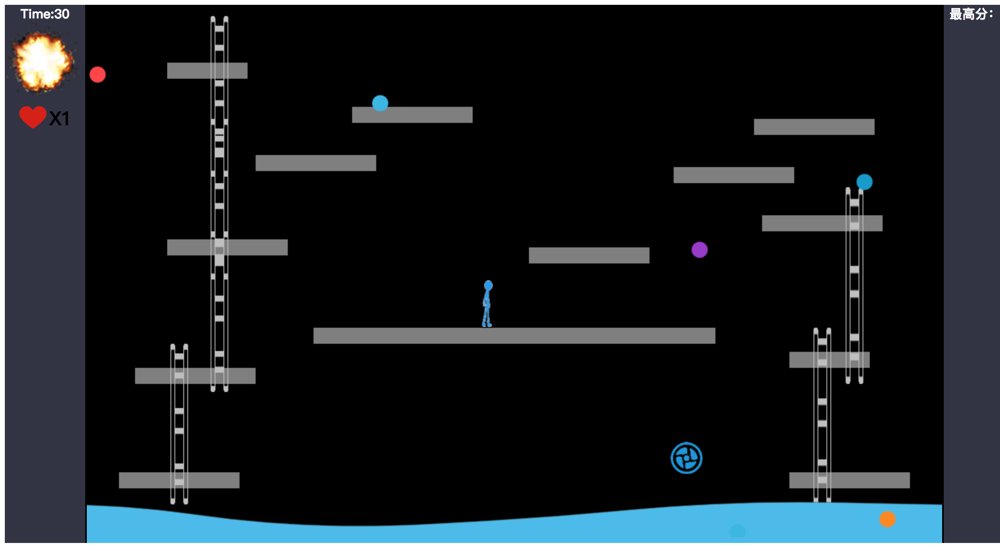

# Mud

## 描述：

大体上是用纯js+canvas完成的小游戏，游戏主角是个蓝色的火柴人，可以上下左右移动跳跃，来躲避不断生成的攻击球，看看可以挺几秒，中间会随机出现道具：增加生命，或者清空当前生命球。

### 大题思路：

就是把所有的东西当成对象封装起来,用setInterval加以渲染以保证物体的位置和其画布位置同步

```js
//这个是生成攻击球的例子
setInterval(function(){
    update();
    renderBall();
},50);
setInterval(function(){
    addBall();
},4000);
```



## 不足：

>1、写这个东西居然用了5层画布。。。，所有有关基础画布设置和DOM操作定义变量部分，和一些控制参数的部分都放到了setting.js里

```js
var lifesfa = document.getElementById('life');
var lifes = lifesfa.children[1];
//上述两行为了改命
var t = 0;
var timer = document.getElementById('timer');
setInterval(function(){
    t+=1;
    timer.innerHTML =  "Time:" +t;
},1000)
var Maxscore = document.getElementById('red');
var storage = window.localStorage;
Maxscore.innerHTML ="最高分：" + storage.getItem('Maxscore');
//以上为基础dom操作
//这里增加一部分考虑，看可不可以通过requestAnimationFrame来做，研究下
var canvas = document.getElementById('myCanvas');
var role = document.getElementById('myRole');
var enemy = document.getElementById('myEnemy');
var ballc = document.getElementById('myBall');
var specc = document.getElementById('mySpecial');
var ctx = canvas.getContext('2d');
var ctr = role.getContext('2d'); //既然不打算用图片只能用两层画布了
var cte = enemy.getContext('2d');//第三层用来放泥潭和小怪物
var ctb = ballc.getContext('2d');//我是真的没有想用第四层，希望以后有好的解决方案
var cts = specc.getContext('2d');//好吧我已经不知羞耻了。。。
```

>2、没有突破js一次性只能识别到键盘上一个按键的问题，因此跳跃之后才能按左右键进行协调（没能摆脱和4399一样的命运orz)
>
>
>3、如果解决了上个问题，才能把red加上，素材都弄好了，有空打造个真正的泥潭出来。。。

ps：git clone 打开index.html即可运行（低版本的IE不支持）